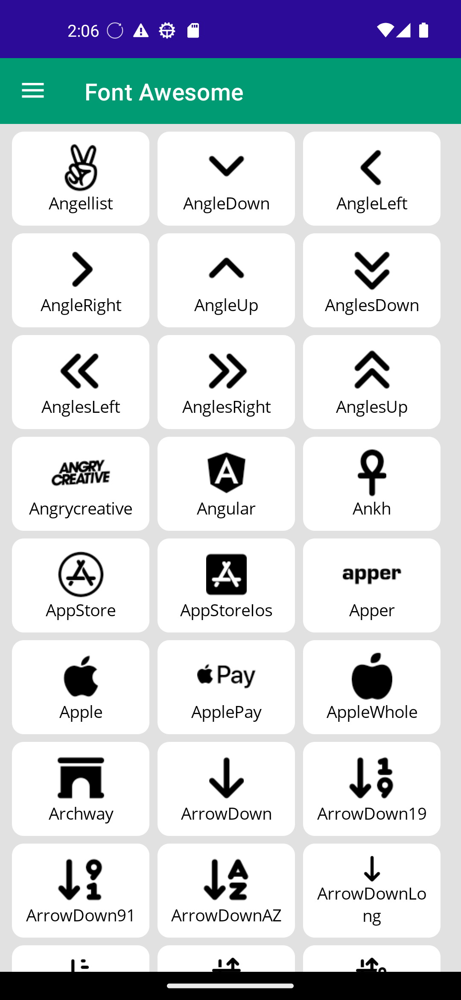
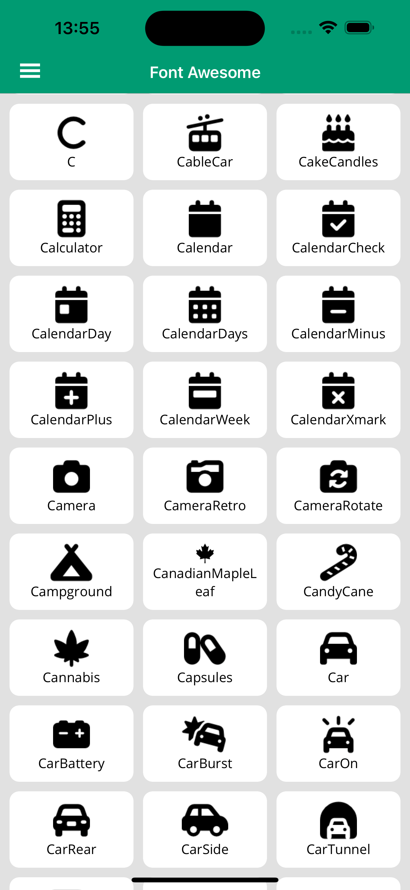
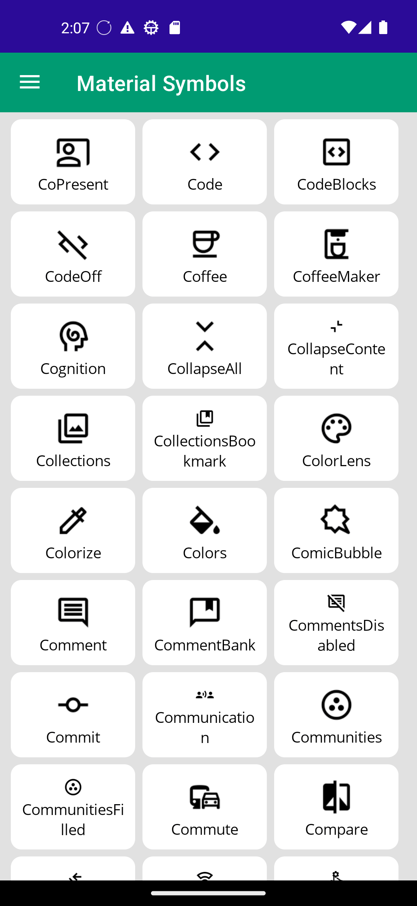
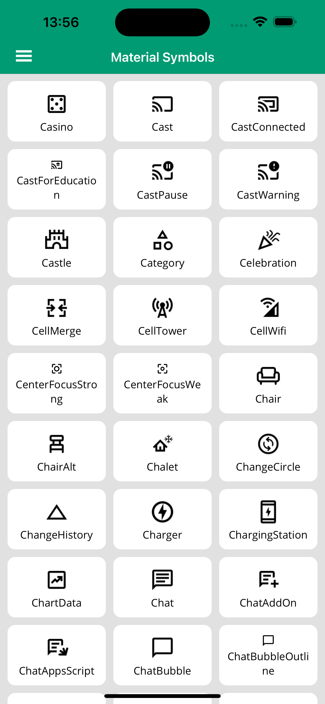

# MauiFontGallery

Sample Maui app demonstrating how to work with Fonts in an convenient way

|                  | Android                                                                      | iOS                                                                      |
|------------------|------------------------------------------------------------------------------|--------------------------------------------------------------------------|
| Font Awesome     |  |  |
| Material Symbols |   |   |

## Architecture

This sample app demonstrates my recommended way of architecting fonts into your maui app. It provides a portable & self contained class library that hosts all of the fonts, glyph names & font family names that can be easily referenced in code or xaml.

The architecture is as follows:
- Maui app
- .NET class library with `<UseMaui>true</UseMaui>`
- `MauiAppBuilder` extension that registers all fonts
- Font files bundled as `MauiFont` in the class library
- `FontConstant` constants file for font family names (preventing magic strings)
- Glyph constants files generated by [fa2cs](https://github.com/matthewrdev/fa2cs) & [md2cs](https://github.com/matthewrdev/md2cs) (all credit to @matthewrdev)

To adapt this to your projects:
- Rename the host builder extension, this should make sense for your library and application ie: `"RegisterAcmeFonts"`
- Rename the fonts `XmlnsDefinition` to something that makes sense for your project / organisation

> Ensure there is a hard project reference between your maui app and fonts project, there may be issues if the fonts project is not directly referenced (ie referenced via another project)

## Icon Fonts

These are registered in the host builder and can be used in a variety of places to jazz up your app. They reduce the reliance on image assets and allow for greater control over appearances of the icons.

They are used in xaml very easily:
```xml
<Image xmlns:fonts="http://acmeapp.com/fonts">
    <Image.Source>
        <FontImageSource Glyph="{x:Static fonts:FontAwesomeIcons.ChevronRight}" FontFamily="{x:Static fonts:FontConstants.FontAwesomeSolid}"/>
    </Image.Source>
</Image>
```